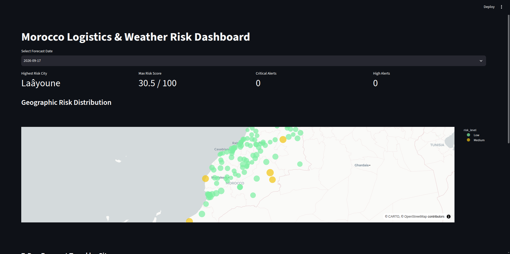
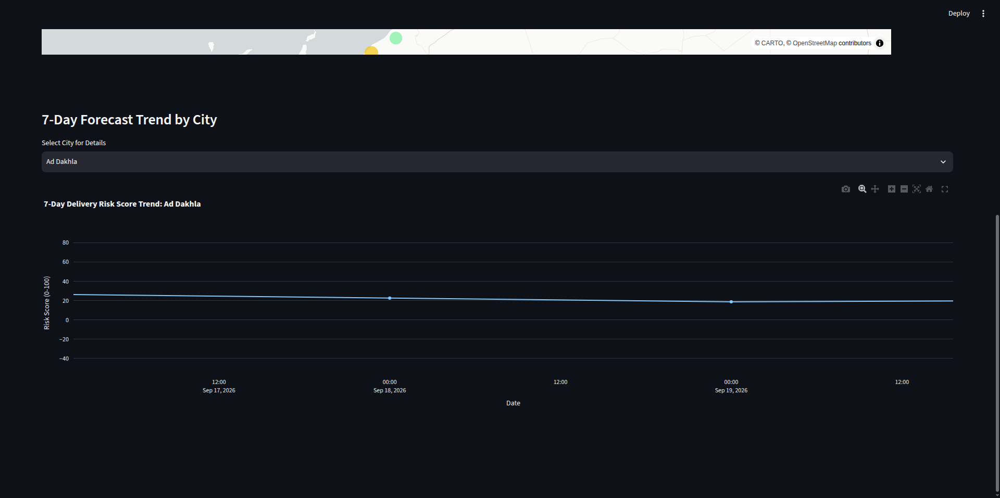

# Morocco Weather Risk Pipeline & Dashboard

## Description du Projet
Ce projet est un pipeline de données de bout en bout (ETL) orchestré avec Apache Airflow, suivant l'architecture Medallion (Bronze → Silver → Gold). Le pipeline extrait les prévisions météorologiques pour plusieurs villes marocaines, transforme et nettoie les données, calcule un score d'évaluation des risques météorologiques (chaleur, pluie, rafales), stocke les données modélisées dans une base de données PostgreSQL, et expose un tableau de bord analytique interactif développé avec Streamlit.

---

## Sources de Données et API
* **Base des villes** : Fichier local `ma.csv` contenant la liste des villes du Maroc, leurs régions administratives et leurs coordonnées géographiques (latitude/longitude).
* **API Météorologique** : **Open-Meteo API** (Free Weather Forecast API).
  * Données collectées : Températures (max, min), précipitations totales, probabilités de pluie, vitesse maximale du vent, rafales de vent et codes météo WMO sur un horizon de 7 jours.

---

## Architecture du Pipeline (Bronze → Silver → Gold)

Le traitement des données suit le pattern Medallion :

1. **Couche Bronze (`extraction/`)** :
   * Données brutes ingérées directement depuis l'API Open-Meteo sans altération.
   * Format de stockage : Fichiers JSON bruts et CSV source dans `data/bronze/`.

2. **Couche Silver (`transformation/transform_silver.py`)** :
   * Nettoyage, normalisation des formats de dates et suppression des doublons ou valeurs aberrantes.
   * Format de stockage : Fichiers colonnaires optimisés Parquet dans `data/silver/`.

3. **Couche Gold (`transformation/transform_gold.py`)** :
   * Agrégations métier et calcul de métriques décisionnelles.
   * Calcul du **Score de Risque** (pondération température, pluie, rafales de vent) et classification par niveau (`Low`, `Medium`, `High`, `Critical`).
   * Format de stockage : Fichiers Parquet consolidés dans `data/gold/`.

---

## Schéma du Data Warehouse (PostgreSQL)

Les données de la couche Gold sont insérées dans PostgreSQL (`load/load_postgres.py`) selon un schéma relationnel normalisé :

* **Table `cities`** :
  * `id` (SERIAL PRIMARY KEY)
  * `city_name` (VARCHAR, UNIQUE)
  * `admin_name` (VARCHAR)
  * `latitude` (DOUBLE PRECISION)
  * `longitude` (DOUBLE PRECISION)

* **Table `weather_forecasts`** :
  * `id` (SERIAL PRIMARY KEY)
  * `city_id` (INT, FOREIGN KEY REFERENCES cities(id))
  * `forecast_date` (DATE)
  * Métriques : `temp_max`, `temp_min`, `precipitation`, `precipitation_prob`, `wind_speed`, `wind_gusts`, `weather_code`
  * Catégorisations & Risques : `temp_category`, `rain_category`, `wind_category`, `risk_score`, `risk_level`
  * `updated_at` (TIMESTAMP)
  * Contrainte d'unicité : `UNIQUE (city_id, forecast_date)` pour permettre des opérations d'upsert (`ON CONFLICT DO UPDATE`).

---

## Modélisation UML

* **Diagramme des Cas d'Utilisation** :  
  `[Click here](https://lucid.app/lucidchart/82245c29-c961-4a67-89f7-8710237e23d1/edit?viewport_loc=320%2C100%2C2229%2C1044%2C.Q4MUjXso07N&invitationId=inv_7331a68a-b57f-4c81-a8b8-a561c52b7f40)`

---

## Instructions d'Installation et Exécution

### Prérequis
* Docker & Docker Compose installés
* Port `5432` (Postgres), `8080` (Airflow) et `8501` (Streamlit) disponibles sur votre machine

### Lancement du Projet

1. **Cloner le dépôt** :
   ```bash
   git clone <URL_DU_REPO_GIT>
   cd morocco-weather-pipeline

2. **Lancer tous les services avec Docker Compose** :
   ```bash
   docker compose up -d --build

3. **Vérifiez que tous les conteneurs sont bien démarrés** :
   ```bash
   docker compose ps


## Accès aux Interfaces et Services

| Service | URL / Port | Identifiants par Défaut |
| :--- | :--- | :--- |
| **Streamlit Dashboard** | [http://localhost:8501](http://localhost:8501) | Aucun |
| **Apache Airflow UI** | [http://localhost:8080](http://localhost:8080) | `admin` / `admin` |
| **PostgreSQL Database** | `localhost:5432` | User: `imad` \| Base: `weather_db` \| Pass: `imadpostgres` |

### Exécuter le Pipeline manuellement
1. Connectez-vous sur l'interface Airflow (`http://localhost:8080`).
2. Activez le DAG `morocco_weather_pipeline`.
3. Cliquez sur **Trigger DAG** pour exécuter l'extraction, la transformation Bronze ➔ Silver ➔ Gold et le chargement PostgreSQL.

---

## Captures d'Écran du Dashboard


*Figure 1 : Vue globale des prévisions, cartes interactives et alertes de risques.*


*Figure 2 : Filtrage dynamique par ville, niveau de risque et indicateurs météo détaillés.*
```[cite: 9]